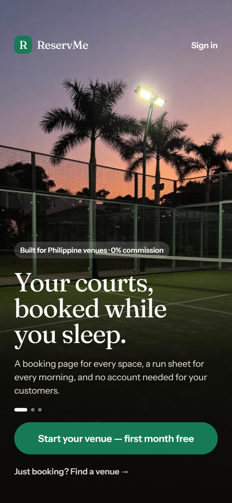
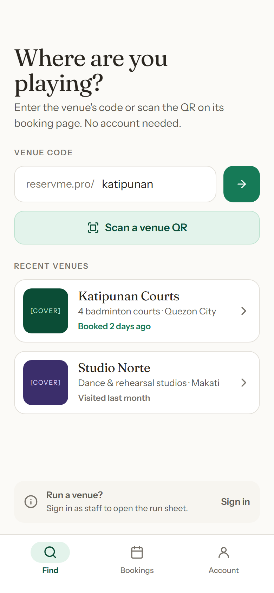

# ReservMe (mobile)

> **Status:** Phase 4 — every screen in the plan is built and works against
> the in-app fake world: the customer booking loop, the venue desk, onboarding,
> and the owner half (spaces, settings, team, billing, insights, account).
> What is left is a backend to talk to, and a device to prove it on.

Flutter app for [ReservMe](https://reservme.pro), booking software for
Philippine venues — courts, studios, rooms, tours. One app, two modes:
customers find a venue and book **without an account**; venue owners and staff
sign in to run the day. After launch the app is the venue's only surface.

The backend is the Next.js app in the sibling `reservme` repository. The
mobile endpoints do not exist yet; they are specified in
[docs/API-CONTRACT.md](docs/API-CONTRACT.md) and faked in-app until they ship.

Design: the canvas at https://claude.ai/artifact/AwVPCW5bJKPBXo5RJBp7ek
(foundations, atoms, molecules, every screen, dark mode). Every widget in
`lib/core/ui` and `lib/core/theme` is a board on it.

| O0 · Welcome (venue onboarding) | C1 · Find a venue (customer) |
|---|---|
|  |  |

Both are boards from the canvas, not app screenshots — the app has not been
walked on a device yet (`docs/DEFERRED.md`, D18). The photo is an
AI-generated placeholder to be replaced before store submission (D2b).

## Run

```bash
flutter pub get
dart run build_runner build
flutter run --dart-define=API_MODE=fake     # default: fully offline demo world
flutter run --dart-define=API_MODE=real     # against the live API (nothing shipped yet)
```

Fake-mode accounts: `owner@reservme.test` (owner of Katipunan Courts, Studio
Norte, Marikina Futsal) and `staff@reservme.test` (front desk at Katipunan),
password `password123`. In fake mode the sign-in screen offers both as
one-tap chips.

Optional defines: `SERVER_URL` (default `https://app.reservme.pro`),
`PUBLIC_ORIGIN` (`https://reservme.pro`), `APP_ORIGIN`.

## Check

```bash
flutter analyze
flutter test
```

## Docs

- [docs/ARCHITECTURE.md](docs/ARCHITECTURE.md) — modes, layers, `API_MODE`, the design system in code
- [docs/API-CONTRACT.md](docs/API-CONTRACT.md) — backend contract (#1–#34)
- [docs/DEFERRED.md](docs/DEFERRED.md) — everything knowingly left undone, and the phase that picks it up
- [docs/RELEASE.md](docs/RELEASE.md) — what must be true before a build ships, signing, deep-link verification
- [docs/STORE-LISTING.md](docs/STORE-LISTING.md) — store copy, data-safety answers, screenshot list (draft)
- [docs/MAC-SETUP.md](docs/MAC-SETUP.md) — building the iOS side on a Mac

## Toolchain

Flutter stable (3.47+), Android SDK 36, JDK 17+ (Android Studio's bundled JBR
works). iOS builds need Xcode on a Mac.

### Windows note: Gradle "Unable to establish loopback connection"

On some Windows machines the JDK cannot create the Unix-domain socket it uses
for NIO selectors inside `%LOCALAPPDATA%\Temp`. Point the JDK at a plain
directory instead:

```powershell
New-Item -ItemType Directory -Force C:\dev\tmp | Out-Null
[Environment]::SetEnvironmentVariable("JAVA_TOOL_OPTIONS", "-Djdk.net.unixdomain.tmpdir=C:\dev\tmp", "User")
```

Open a new terminal afterwards.

## Contributing

Branches are named by kind: `feat/…` for features, `bug/…` for fixes,
`chore/…` for docs, CI, config and releases. Open a PR against `main`; CI
runs `flutter analyze` and `flutter test`. Generated `*.g.dart` /
`*.freezed.dart` files are committed; CI fails if they go stale.
